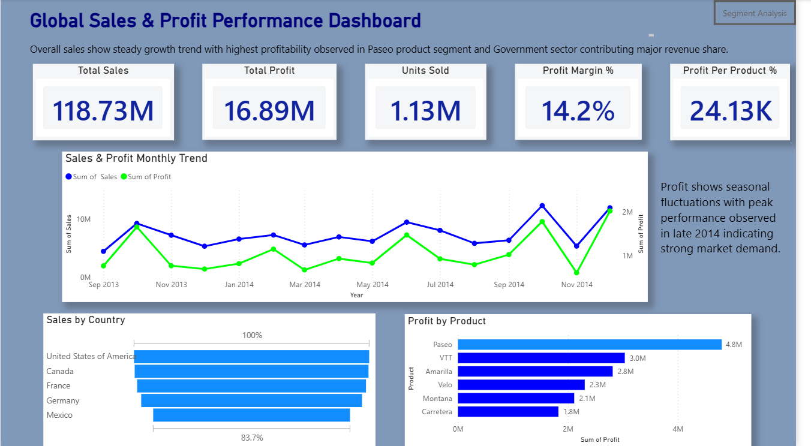

# 📊 Financial Sales Performance Dashboard – Power BI  

## 📸 Dashboard Preview

## 📌 Project Overview  
This project focuses on analyzing financial sales data using Microsoft Power BI to generate meaningful business insights. The dashboard provides interactive visualizations to understand sales trends, profit distribution, regional performance, and product category analysis. The objective is to support effective data-driven decision-making through clear and dynamic visualization.

## 🎯 Objectives  
- Analyze overall sales and profit performance  
- Identify high-performing products and regions  
- Visualize monthly and yearly profit trends  
- Develop an interactive business intelligence dashboard  

## 🗂 Dataset  
- Microsoft Financial Sample Dataset  
- Includes fields such as Product, Country, Sales, Profit, Date, and Segment  

## ⚙️ Tools & Technologies Used  
- Microsoft Power BI  
- Power Query (Data Cleaning & Transformation)  
- DAX (Data Analysis Expressions)  
- Microsoft Excel Dataset  

## 📈 Dashboard Features  
- KPI cards displaying Total Sales and Total Profit  
- Line chart for profit trend analysis  
- Bar charts for regional and product performance  
- Map visualization for global sales distribution  
- Interactive slicers for dynamic filtering  

## ✅ Outcomes  
The dashboard enables quick understanding of financial performance, helps identify profitable business areas, and improves strategic decision-making.

## 🚀 Future Improvements  
- Integration with real-time sales databases  
- Implementation of predictive analytics  
- Deployment through cloud and mobile platforms  
